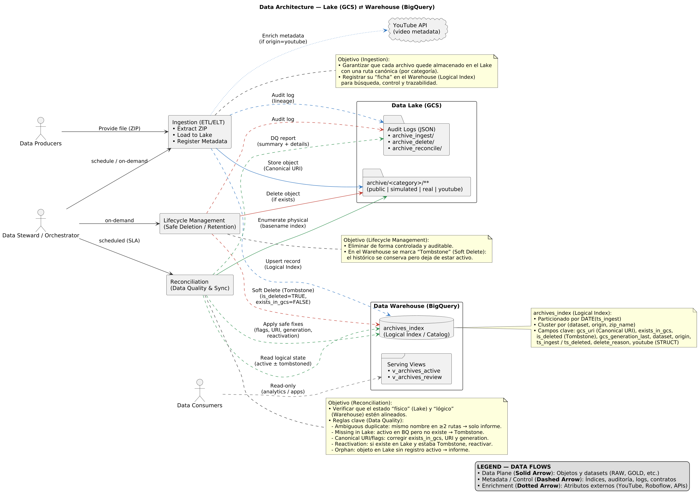
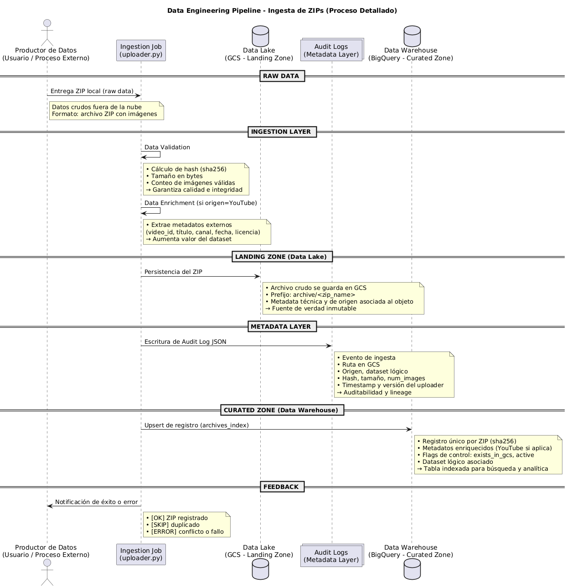
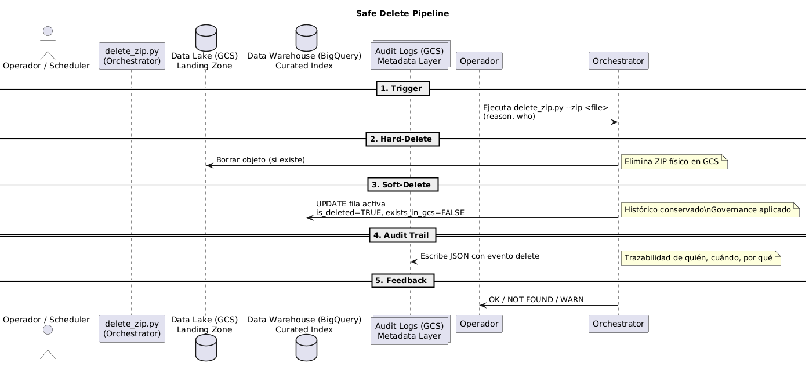
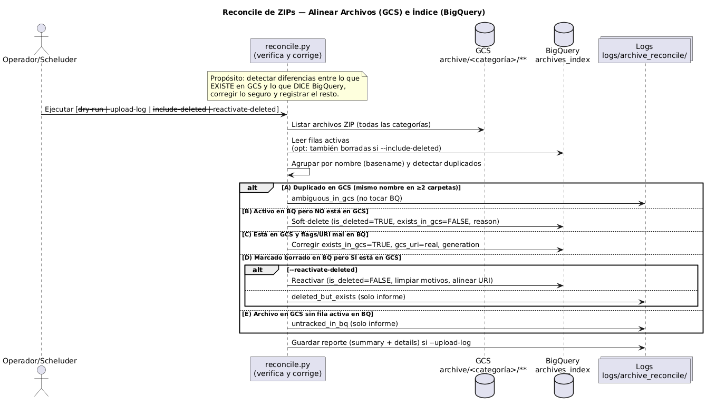

# **HUD AI Ingestion Pipeline**

El propósito es **diseñar y desplegar un pipeline de ingesta** robusto para artefactos en formato ZIP, asegurando un ciclo de vida auditado, idempotente y consistente entre el Data Lake (Google Cloud Storage) y el Data Warehouse (BigQuery).

El sistema implementa un control integral sobre los datos en las fases de:

* **Ingesta:** Subida y registro de artefactos.
* **Borrado seguro:** Soft-delete con trazabilidad.
* **Reconciliación:** Sincronización entre estado físico y lógico, con detección de inconsistencias.

## **Índice**

* [Visión general](#visión-general)
* [Arquitectura](#arquitectura)
* [Modelo de datos](#modelo-de-datos)
* [Componentes](#componentes)
* [Estructura del repositorio](#estructura-del-repositorio)
* [Configuración y requisitos](#configuración-y-requisitos)
* [Uso — CLI unificada](#uso--cli-unificada)
* [Makefile](#makefile)
* [Serving Views & Looker Studio](#serving-views--looker-studio)
* [Observabilidad y auditoría](#observabilidad-y-auditoría)
* [Seguridad y permisos](#seguridad-y-permisos)
* [Hoja de ruta](#hoja-de-ruta)
* [Glosario breve](#glosario-breve)

## **Visión general**

Este proyecto materializa un *data loop* sencillo pero robusto:

* **Ingesta (Uploader):** Proceso de incorporación formal de un artefacto comprimido (ZIP) al *Data Lake*. La operación no se limita al mero volcado binario, sino que consolida la trazabilidad mediante la escritura de **metadatos de objeto** (dimensiones, origen, huellas criptográficas) y la inserción consistente de un registro en el *Data Warehouse*, garantizando alineación semántica y persistencia de linaje.

* **Borrado seguro (Delete):** Supresión controlada de un objeto en el *Data Lake*, condicionada a su existencia física. La acción establece la primacía del *Single Source of Truth* (SSOT) en el *Data Warehouse*, asegurando coherencia sistémica y dejando constancia indeleble en un **log de auditoría**, lo que blinda el proceso frente a ambigüedades regulatorias y favorece la reproducibilidad histórica.

* **Reconciliación (Reconcile):** Mecanismo de inspección y saneamiento entre el **estado físico** (repositorio en GCS) y el **estado lógico** (catálogo en BigQuery). El algoritmo aplica una regla de hierro: corregir lo objetivamente cierto (actualizando *flags* y URIs) y elevar a informe lo epistemológicamente dudoso (archivos duplicados, huérfanos o inconsistentes). Se admite además la **resurrección controlada de tombstones**, esto es, la reactivación de registros previamente marcados como eliminados cuando surge evidencia empírica de su existencia material en el Lake.

**Principios:** *Single source of truth (SSOT)* por archivo, trazabilidad completa mediante logs estructurados, idempotencia de todas las operaciones y políticas conservadoras ante ambigüedad.

## **Arquitectura**

* **Data Lake (GCS):** Prefijo estándar `archive/<categoría>/...` con categorías **`public|simulated|real|youtube`** (y tolerancia para `archive/<zip>` sin categoría aunque se recomienda con una categoria por trazabilidad).
* **Data Warehouse (BigQuery):** Tabla principal`archives_index` que indexa procedencia, estado y metadatos de cada artefacto.
* **Observabilidad:** Logs en formato JSON almacenados en GCS para cada operación:
  * `logs/archive_ingest/`
  * `logs/archive_delete/`
  * `logs/archive_reconcile/`



## **Modelo de datos**

El modelo de datos se articula en torno a una única tabla central en BigQuery que actúa como **índice lógico de artefactos**. Esta tabla se encuentra particionada por la fecha de ingesta (`ts_ingest`) y clusterizada por los atributos `dataset`, `origin` y `zip_name`, lo que facilita consultas eficientes y un acceso optimizado a la información.

Los campos principales se agrupan en cuatro dimensiones:

* **Identificación y estado**: incluye el nombre del archivo comprimido (`zip_name`), la ruta física en el Data Lake (`gcs_uri`), así como indicadores binarios que señalan si el artefacto existe en almacenamiento (`exists_in_gcs`) o si ha sido eliminado lógicamente (`is_deleted`). El campo `gcs_generation_last` registra la versión interna del objeto en GCS, garantizando consistencia frente a sobrescrituras.

* **Procedencia y origen**: describe el contexto del artefacto mediante el campo `origin`, que puede tomar valores como `public`, `simulated`, `real` o `youtube`. También se recogen referencias externas (`source_url`) y el dataset lógico al que pertenece (`dataset`).

* **Ingesta y características técnicas**: se capturan huellas digitales y métricas del archivo, como el hash criptográfico (`sha256_zip`), el tamaño en bytes (`zip_size_bytes`), el número de imágenes contenidas (`num_images`) y la marca temporal de ingesta (`ts_ingest`).

* **Borrado lógico**: en los casos en que un artefacto es eliminado, se registra la fecha de borrado (`ts_deleted`), el motivo (`delete_reason`) y el responsable de la operación (`deleted_by`). Esto permite mantener un historial completo y auditable.

* **Metadatos de YouTube (estructura opcional)**: para los artefactos procedentes de esta fuente se conserva información adicional, incluyendo identificador de vídeo, título, canal de origen, fecha de publicación y licencia. Estos datos permiten mantener trazabilidad con la fuente original del contenido: `youtube.video_id`, `youtube.title`, `youtube.channel`, `youtube.publish_date`, `youtube.license`.

## **Componentes**

### **Ingesta de datos: `uploader.py`**

* Sube `--zip` a `gs://<BUCKET>/archive/<origin>/<zip_name>`.
* Escribe **object metadata** (sha256, num\_images, ts\_ingest, etc.).
* Log JSON en `logs/archive_ingest/`.
* Inserta/actualiza fila en BQ (`archives_index`) con `gcs_uri`, `origin`, `exists_in_gcs=TRUE`, etc.
* Para `--origin youtube` requiere `--url` y persiste metadatos del vídeo.



### **Borrado con soft-delete: `delete_zip.py`**

* Borra `archive/<origin>/<zip>` si `--origin` es explícito. Sin `--origin`, **resuelve** buscando en todas las categorías:
  * **1 coincidencia:** Borra ahí.
  * **>1 coincidencia:** Aborta (evita borrar la copia equivocada).
  * **0 coincidencias:** No hay objeto; continúa para trazar y sincronizar BQ.
* **Soft-delete en BQ** (Tombstone): `is_deleted=TRUE`, `exists_in_gcs=FALSE`, `delete_reason`, `deleted_by`, `gcs_generation_last`.
* Log JSON en `logs/archive_delete/`.



### **Sincronización Lake y Warehouse: `reconcile.py`**

* Escanea `archive/**` y **agrupe por basename** (p.ej., `LISA_images.zip`).
* Detecta **duplicados** (mismo basename en ≥2 rutas), como **ambiguous** y **solo informa**, **no** muta BQ.
* **Activos en BQ pero ausentes en GCS** equivale a **tombstone** en BQ.
* **Archivo existe pero flags/URI incorrectos**, se corrige `exists_in_gcs=TRUE`, `gcs_uri` y `gcs_generation_last`.
* Opciones:
  * `--dry-run` (no cambios), `--upload-log` (sube reporte),
  * `--include-deleted` (analiza tombstones),
  * `--reactivate-deleted` (revive tombstones si el archivo existe).
* Reporta también **huérfanos** (objeto en Lake sin fila activa en BQ).



### **Reglas de reconciliación**

1. **Duplicado (ambiguous)** Mismo basename en $\geq 2$ rutas del Lake, entonces **no muta BQ**, solo reporta `ambiguous_in_gcs`.
2. **Activo en BQ pero ausente en GCS**
   * **Tombstone**: `is_deleted=TRUE`, `exists_in_gcs=FALSE`, `delete_reason`.
3. **Existe en GCS pero flags/URI desalineados**
   Corrige `exists_in_gcs=TRUE`, `gcs_uri` canónica y `gcs_generation_last`.
4. **Tombstone en BQ y el archivo existe**
   * `--include-deleted`: solo informe (`deleted_but_exists`).
   * `--reactivate-deleted`: **reactiva** fila (`is_deleted=FALSE`, limpia motivos, alinea URI y generation).
5. **Huérfano (objeto en Lake sin fila activa en BQ)**
   Solo informe (`untracked_in_bq`); no inserta automáticamente.
6. **Edge sin categoría (`archive/<zip>`)**
   Se trata como ubicación válida; puede corregir flags/URI. Si además existe en una categoría, se considera **ambiguous**.

## **Estructura del repositorio**

```bash
.
├─ src/
│  ├─ uploader.py        # Ingesta en Lake + Índice en Warehouse + Logs
│  ├─ delete_zip.py      # Borrado seguro en Lake + Tombstone en Warehouse + Log
│  ├─ reconcile.py       # Sincronización Lake↔Warehouse + Reporte
│  └─ utils_youtube.py   # Helpers para metadatos de YouTube
├─ docs/
│  ├─ diagrams/          # Diagramas en formato .puml
│  └─ diagrams_rendered/ # Diagramas renderizados
├─ sql/
│  ├─ archives_index.sql
│  └─ views/{v_archives_active.sql, v_archives_review.sql}
├─ Makefile              # Atajos (bash) y autoload de .env
├─ .env.sample           # Variables de entorno de ejemplo
├─ main.py               # CLI unificada (subcomandos: upload, delete, reconcile)
└─ README.md
```

## **Configuración y requisitos**

* **Python** (versión fijada en `pyproject.toml`).
* **Poetry** ≥ 1.8.
* **Credenciales GCP** con permisos adecuados.
* **Variables de entorno** (via `.env`): Se contiene un archivo a modo de ejemplo en `env/sampple.env`

  ```bash
  GCP_PROJECT=...
  GCS_BUCKET=svr_object_storage
  BQ_DATASET=hud_project
  BQ_TABLE_ARCHIVES=archives_index
  UPLOADER_VERSION=uploader-v1
  ```

## **Uso — CLI unificada**

La herramienta expone una **CLI centralizada** que permite ejecutar todas las operaciones del pipeline desde un único punto de entrada (`main`). Esto simplifica la interacción, evita tener que recordar rutas específicas y mantiene la coherencia en el flujo de trabajo.

La ayuda general y por comando puede consultarse con:

```bash
python -m main -h
python -m main upload -h
python -m main delete -h
python -m main reconcile -h
```

### **Ingesta de datos: `Upload`**

Permite subir archivos ZIP al *Data Lake (GCS)* y registrar sus metadatos en el *Data Warehouse (BigQuery)*.
El comando requiere el ZIP, el origen de los datos (`public`, `simulated`, `real`, `youtube`) y el nombre del dataset.

```bash
python -m main upload --zip /path/LISA_images.zip --origin public --dataset lisa
```

Para YouTube, además del ZIP, se debe de incluir la URL de referencia:

```bash
python -m main upload --zip /path/yt_abc123.zip --origin youtube --url "https://youtu.be/abc123" --dataset yt_set
```

### **Borrado con soft-delete: `Delete`**

Este comando marca el archivo como **eliminado lógicamente** en BigQuery (tombstone), manteniendo trazabilidad. Si el ZIP está en GCS, también se elimina físicamente.

* Si no se especifica --origin, el sistema intentará resolverlo automáticamente.
* En caso de duplicados, la operación aborta para garantizar consistencia.

```bash
python -m main delete --zip LISA_images.zip --origin public --reason "cleanup" --who "cli"
```

### **Sincronización Lake y Warehouse: `Reconcile`**

Mantiene sincronizados los objetos del Data Lake con los registros en el Data Warehouse.
Incluye opciones de vista previa, aplicación y reactivación de registros.

* Todos los comandos generan logs estructurados en JSON para auditoría.
* Las operaciones son **idempotentes**, es decir, pueden ejecutarse múltiples veces sin provocar inconsistencias.
* El flag `--who` permite registrar de forma explícita el origen de la acción (CLI, reconciliador automático, etc.), mejorando la trazabilidad.

```bash
# Vista previa de cambios sin aplicar
python -m main reconcile --dry-run

# Aplicar reconciliación y subir informe al bucket de logs
python -m main reconcile --upload-log

# Incluir registros eliminados en el análisis
python -m main reconcile --include-deleted --dry-run

# Reactivar tombstones si el archivo aún existe en GCS
python -m main reconcile --reactivate-deleted --who "reconcile-cli" --upload-log
```

## **Makefile**

El repositorio incluye un **Makefile** con atajos que facilitan la ejecución de los comandos más comunes del pipeline. De esta forma no es necesario recordar todas las banderas de la CLI, y además se asegura la carga automática de las variables de entorno definidas en `.env`.

* **Simplificación:** Comandos más cortos y legibles.
* **Automatización:** Garantiza que se carguen las variables de entorno necesarias.
* **Consistencia:** Asegura que las llamadas a la CLI se hagan siempre de la misma forma.
* **Portabilidad:** Los atajos pueden reutilizarse en entornos locales, de integración continua o despliegue en la nube.

> Nota: En Windows debe ejecutarse con Git Bash o WSL, ya que la sintaxis está basada en bash.

```bash
# Verificar que las variables de entorno clave están definidas
make env-check

# Ingesta de datos (ejemplo con dataset público)
make upload ZIP="/path/LISA_images.zip" ORIGIN=public DATASET=lisa

# Borrado seguro (soft-delete en BigQuery y opcional en GCS)
make delete ZIP="LISA_images.zip" ORIGIN=public REASON="cleanup" WHO="cli"

# Reconciliar estado Lake y Warehouse
make reconcile-dry   # Vista previa (no aplica cambios)
make reconcile       # Aplica cambios y genera log en GCS

# Reactivar registros eliminados si el archivo sigue existiendo
make reactivate WHO="reconcile-cli"
```

## **Serving Views & Looker Studio**

Esta sección describe la **capa de servicio** que exponemos desde el **Data Warehouse (BigQuery)** y su **consumo analítico** en **Looker Studio**. El objetivo es ofrecer un **contrato de datos estable**, desacoplado de la tabla operativa, con **semántica clara**, **gobernanza** y buen **rendimiento** para cuadros de mando.

### **Serving Views**

* **`Archives Active`**: Capa de lectura “gold” para **activos consumibles**. Solo expone registros **no eliminados** y con **existencia física** confirmada en el Lake.
  * **Uso principal:** Analítica operativa, reporting de ingesta, control de volumen y mix por origen/dataset.

* **`Archives Review`**: Capa de **stewardship** para **incidencias** (p. ej., desalineación entre estado lógico y físico).
  * **Uso principal:** calidad de datos, auditoría, listas de remediación.

> **Contratos y gobernanza**
>
> * Las views son **read-only** y constituyen el **data contract** con analistas y aplicaciones.
> * El equipo de datos mantiene **alineación** y **frescura** mediante el job de **reconciliación**.
> * Accesos recomendados a nivel de **dataset** o **vista autorizada**, con visibilidad selectiva por rol.

### **Conexión con Looker Studio**

Looker Studio se usará como una **capa semántica ligera** sobre las vistas de BigQuery, trabajando en modo **conexión en vivo**. Se recomienda usar **filtros de fecha** y de campos como `origin` o `dataset` para reducir escaneos y mejorar la latencia. Si el volumen de datos crece, puede activarse **BI Engine** o generar vistas agregadas diarias para optimizar rendimiento.

El tablero se organiza en filas temáticas: **KPIs ejecutivos** con métricas clave desde `Archives Active`; **trends temporales** para seguir la evolución de ZIPs, imágenes y tamaños; **distribuciones por origen/dataset** para análisis de bias y cobertura; y una sección de **lifecycle & quality** apoyada en `Archives Review` para auditar incidencias. Opcionalmente, se incluye un bloque específico para **YouTube**, con análisis por canal o licencia si aplica.

## **Observabilidad y auditoría**

* **Ingesta:** `logs/archive_ingest/<zip>.json`
* **Borrado:** `logs/archive_delete/<zip>.json`
* **Reconcile:** `logs/archive_reconcile/<timestamp>.json` (summary + details)

Campos típicos: evento, `zip_name`, `gcs_uri`, `ts`, `reason`, `deleted_by`, `gcs_generation_last`, indicadores de existencia y listas de casos.

## **Seguridad y permisos**

Rol mínimo para la cuenta de ejecución:

* **Storage:** `roles/storage.objectAdmin`
* **BigQuery:** `roles/bigquery.dataEditor` + `roles/bigquery.jobUser`

> Recomendado: cuenta de servicio dedicada, rotación de credenciales y límites por entorno (dev/stg/prod).

## **Hoja de ruta**

* Script opcional de **migración** `archive/<zip>` en `archive/<category>/<zip>`.
* Métricas operativas (SLO de reconciliación): % activos alineados, % duplicados, MTTR de inconsistencias.
* Pipeline de **curación** post-ingesta (descomprimir, normalizar, indexar imágenes).

## **Glosario breve**

* **Lake (GCS):** Almacenamiento físico de artefactos.
* **Warehouse (BQ):** Catálogo lógico indexado para consumo.
* **Tombstone / Soft-delete:** Registro marcado eliminado pero no purgado (`is_deleted=TRUE`).
* **Canonical URI:** `gcs_uri` que refleja la ruta real del objeto.
* **Ambiguous:** Mismo basename en varias rutas, lo cuál requiere resolución manual.
